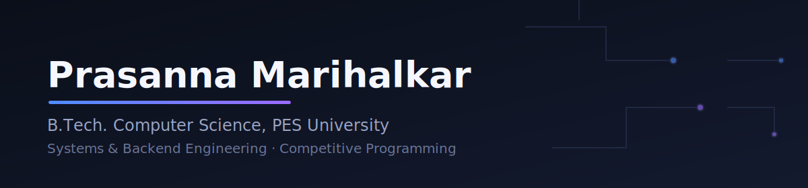

  

 

## About Me

- 🎓 B.E. Computer Science Engineering, PES University, RR Campus (2024 – 2028) ·
- 🔬 R&D Member @ **PI Labs, PESU** — building **Socratic Mirror**, an LLM-powered reflective learning tool
- 💼 Former AI/Software Engineering Intern @ **DecodeLabs** and **BSERC**
- 🏆 200+ problems solved on Codeforces, national-level participant at Smart India Hackathon 2024
- 🛠️ Currently building **cpp-lockfree-queue**, a lock-free SPSC ring buffer with real benchmarks

 

## Tech Stack

 

## Experience

<table>
<tr><td width="140"><b>DecodeLabs</b></td><td>AI / Software Engineering Intern — May 2026 – Jun 2026 Built a rule-based AI chatbot, a KNN classification pipeline (~97% F1), and a TF-IDF tech stack recommender.</td></tr>
<tr><td><b>BSERC</b></td><td>Software / AI Intern — May 2026 - July 2026 Working On AI Agents and Cyber Security</td></tr>
<tr><td><b>PI Labs, PESU</b></td><td>R&D Member — Ongoing Building Socratic Mirror: prompt architecture and conversational state management for an LLM-powered Socratic questioning tool.</td></tr>
</table>

 

## Featured Projects

<table>
<tr>
<td width="50%" valign="top">

**[cpp-lockfree-queue](https://github.com/PrasannaMarihalkar/cpp-lockfree-queue)**
Lock-free SPSC ring buffer in C++, cache-line padded, benchmarked against a mutex-based baseline.
`C++` `Systems`

</td>
<td width="50%" valign="top">

**[Socratic Mirror](https://github.com/PrasannaMarihalkar/socratic-mirror)**
LLM-powered Socratic dialogue engine (FastAPI + Llama 3.3 70B + Supabase), submitted to Bharat Academix CodeQuest 2026.
`FastAPI` `LLM`

</td>
</tr>
<tr>
<td width="50%" valign="top">

**[Iris Classification](https://github.com/PrasannaMarihalkar/iris-classification)**
KNN pipeline with train-only scaling, odd-K elbow analysis, and multi-algorithm comparison — ~97% F1.
`Python` `scikit-learn`

</td>
<td width="50%" valign="top">

**[Tech Stack Recommender](https://github.com/PrasannaMarihalkar/tech-stack-recommender)**
TF-IDF + cosine similarity content-based filtering engine ranking 20 career paths, with CLI and pytest suite.
`Python` `TF-IDF`

</td>
</tr>
</table>

 

## GitHub Analytics

 

## Contribution Snake

 

## Achievements

 

<i>Open to systems, backend, and applied ML roles — let's talk.</i>

